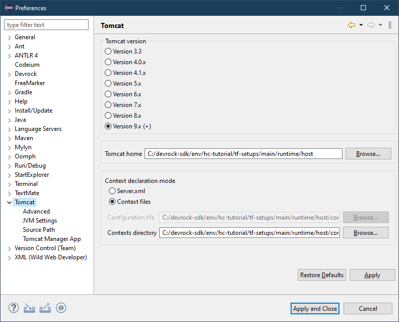

# Tomcat Configuration

Let's have a look at how the `jinni setup-main` command prepares a local `Tomcat` installation and what kind of configuration is created automatically.

## File System

After executing [jinni setup-main](../tutorial/03-create-debug-project.md) we will have (among others) the following directories:

```filesystem
hc-tutorial/
    tf-setups/
        main/
            debug/
                hc-example-setup-debug/
            runtime/
                host/
    eclipse-workspace/
```

The `host` inside `main/runtime` is the actual `Tomcat` installation. Internally it also contains:

```filesystem
host/
    conf/
        Catalina/
            localhost/
                tribefire-services.xml
    webapps/
        tribefire-explorer/
```

The `tribefire-explorer` inside `webapps` is our client application which we access via browser on `http://localhost:8080/tribefire-explorer/`. Note the straight forward mapping of the directory name to the URL.

There is, however, no other application in `webapps`, because we told `jinni` not to do it by setting the `debugJava` to `true` [here](../tutorial/03-create-debug-project.md).

Instead there is `tribefire-services.xml` which references our debug project - `hc-example-setup-debug` - which `jinni setup-main` created inside the `debug` folder.

## Eclipse Configuration

In order to start the server the `Tomcat` plugin needs to know about our `Tomcat` installation. This **Tomcat home** is pre-configured when the workspace is created (with `jinni create-dev-env hc-tutorial`) to:
```plain
env/hc-tutorial/tf-setups/main/runtime/host
```



## Debug Project Purpose

Having the debug-projects in Eclipse workspace alongside all the extension projects means the application is running with the code in _Eclipse_, rather than installed jars. This is thanks to the `devrock` AC plugin, which dynamically manages the dependencies.

BTW some code changes are deployed while the server is running, so `Tomcat` restart isn't always needed.

Re-setup (i.e. installing our extension locally again with `dr` and the running `jinni setup-main`) is only needed if we change the dependencies in some `pom.xml` file. This is needed because when doing a setup the classpath of the extensions is computed and compared with the server's classpath, and a decision is made whether the extension will be "natively" integrated with the server, or separately utilizing a custom class-loader.
