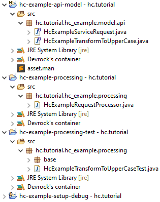

# Eclipse Preparation

Each dev-env comes with its own `Eclipse` workspace. Let's open it from `Eclipse` menu `File/Switch Workspace/Other...` and picking the `tf-tutorial/eclipse-workspace` folder.

From our new workspace import the following projects:
* `tf-example-api-model`
* `tf-example-processing`
* `tf-example-processing-test`
* `tf-example-setup-debug`

Do it by pressing `CTRL + SHIFT + I`, typing `tf-` in the dialog and selecting the projects.

_**Note:** This import feature, including the shortcut, comes from one of the `Devrock` plugins._

The content of our workspace should look like this:

_**Note:** You'll see more files in your workspace, they were hidden here to make the screenshot more compact._

**Brief summary:**

* `tf-example-api-model` is a model for our API and contains one sample request `TfExampleTransformToUpperCase`.
* `tf-example-processing` contains the implementation of our API, i.e. code that handles the request, namely `TfExampleRequestProcessor`.
* `tf-example-processing-test` are tests for `tf-example-processing`.
* `tf-example-setup-debug` is the project for debugging created with `jinni setup-main`. It doesn't have any code, only dependencies (`pom.xml`) and a pointer to the installation folder of our application (file `.tribefire`).
