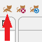

# Run from Eclipse

With all projects in our workspace everything is ready, we just need to start the server.

_**Note:** More info about all the auto-generated configuration is available in the details section linked at the end of this tutorial._

* Start the server by starting `Tomcat` from _Eclipse_:

  


* Open a web-browser at:
  ```url
  http://localhost:8080/tribefire-explorer/
  ```

  and log in:
  * username: `cortex`
  * password: `cortex`

  This should open the workbench of the `cortex` access, i.e. we can now examine our server's configuration including all the 
  * models
  * deployables
  * service domains
  * anything else
