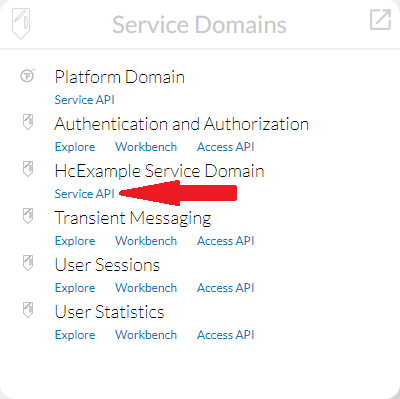

# Testing the Service Processor

So, we have created the extension with a sample `ServiceProcessor` for the API model containing a `HcExampleTransformToUpperCase` request.

Let's test this request with `text`=`"hello"`.

We have two simple ways how to test this request, as our setup includes extensions that bring **REST API** and **Swagger UI**. 

_**Note:** For the sake of this tutorial you might just choose the one you like more._

## REST API

Just enter this URL into browser:
```url
http://localhost:8080/tribefire-services/api/v1/hc_example/HcExampleTransformToUpperCase?text=hello&accept=application/json
```

Expected result:
```
"HELLO"
```

Notes:
* We use `accept=application/json` to make sure JSON is returned. If omitted, the browser would most likely return a little complicated XML.
* Both `GET` and `POST` are supported by default. This can of course be overridden by custom configuration.
* As our request base (`HcExampleServiceRequest`) is an `AuthorizedRequest`, we need some kind of authentication. However, as we have logged in via `tribefire-explorer` in the previous step, we can omit that - the browser sends a cookie.

## Swagger UI

Open the `Hiconic` landing page:
```url
http://localhost:8080/tribefire-services
```

Under `Service Domains` locate `HcExample Service Domain` and click on the `Service API` link.



On the next page:
* locate the `HcExampleTransformToUpperCase` request
* click on the entry for the `GET` HTTP method to expand it
* click the `Try it out` button
* enter `hello` for the text parameter
* click `Execute`

A response with body `"HELLO"` is expected.