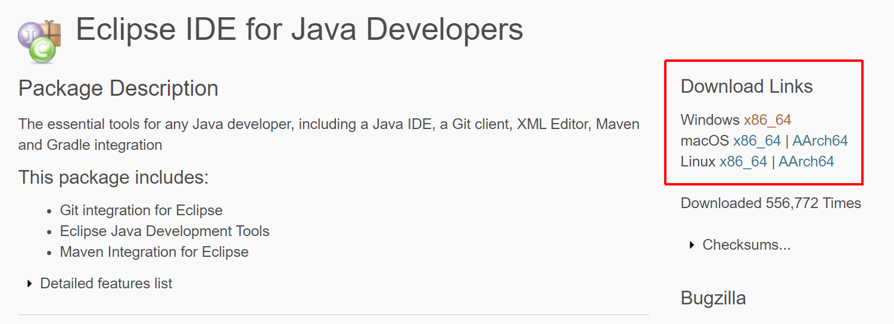
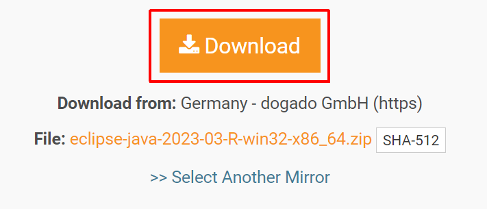

# Download Eclipse

In case you already have an eclipse installation you can immediatly progress to the next step.

Go to [download site](https://www.eclipse.org/downloads/packages/release/2023-03/r/eclipse-ide-java-developers) and follow the link from **Download Links** that fits to your operating system. 

Then click the **Download** button to download.

  

