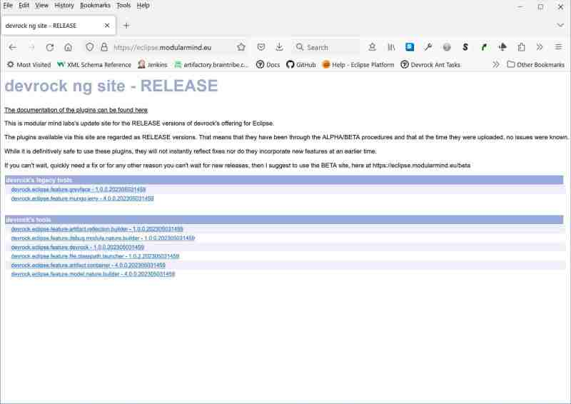

# Devrock update site

## Part III : devrock tool installation 

`Devrock` sports some tools that support working with `Hiconic` and its codebase with `Eclipse`. 

The tools - plugins for `Eclipse` - are hosted in our own update site. 

While the site can be reached via HTTP and one could basically download from it, it's much easier to use `Eclipse` for that as we will do in the next steps.
