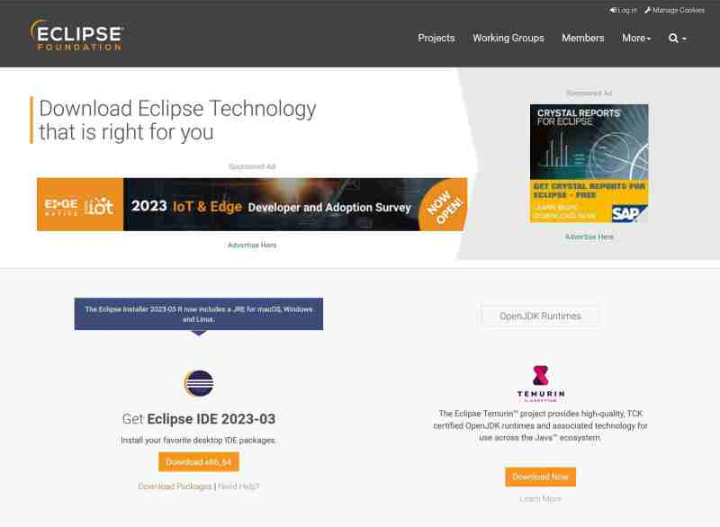

# Download page

## Part I : installing Eclipse

Eclipse is maintained by the Eclipse foundation. 

Go to 

> https://www.eclipse.org/downloads/

The page will prompt you to use the Eclipse installer. But you can also use a packaged installation that you only need to unzip to your drive.

If you want to use the zip method - which has the advantage that it doesn't change your system-setup - select the link below

> download packages

so you can explicitely choose what your Eclipse installation should contain.

