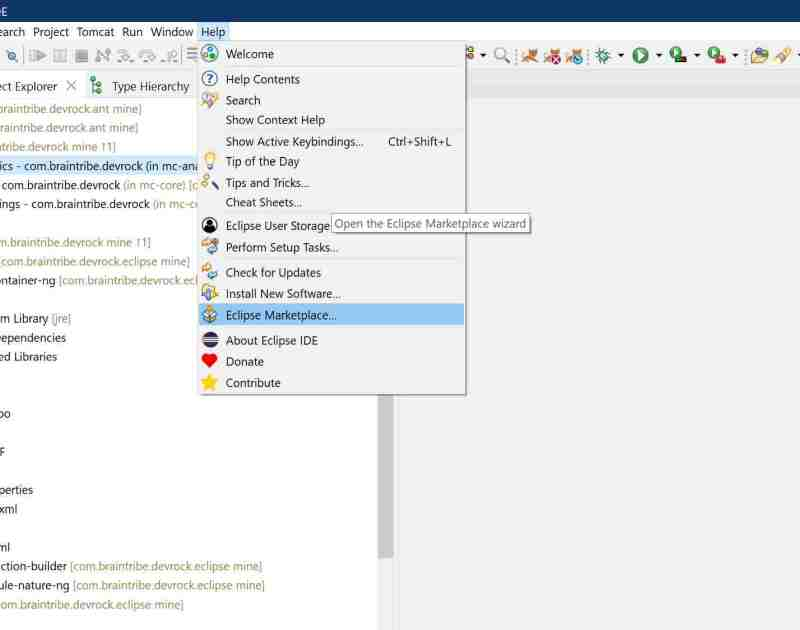

# Marketplace access

## Part II : installing the Tomcat Plugin

As a Tomcat is used for local deployment, an appropriate plugin that supports Tomcat debuggin within Eclipse is required.

Currently, one plugin is to be selected (it is tied into Devrock's tooling for Eclipse)

The easiest way to install this plugin is to use the Eclipse marketplace.

Open the Eclipse Marketplace.
