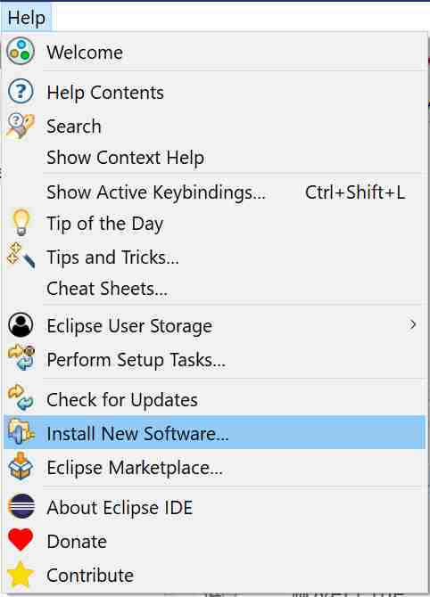

# Eclipse install wizard

## Part III : devrock tool installation 

Eclipse has its own way to install and/or update plugins. 

Call up the menu for installing *new* software.

Select *Install New Software* and open the install

