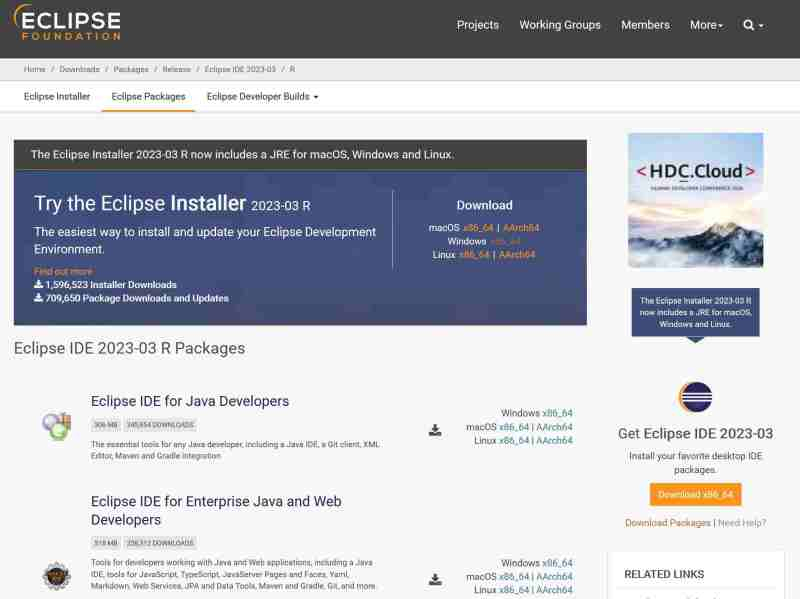

# Package selection

## Part I : installing Eclipse

There are multiple packages for Eclipse, i.e. preconfigured Eclipse with pre-installed features. 

For our purpose, the standard Java package is more than sufficient. 

> Eclipse IDE for Java Developers

