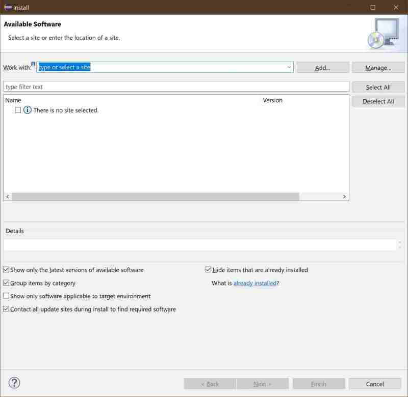

# Update-sites

## Part III : devrock tool installation 

Eclipse has its own dialog to install new software or to update previously installed software.

All external content is contained in such 'Eclipse update-sites'.

So the update-site for the devrock tools needs to be added.

Click on the button *Add..* on the upper right side of the dialog.
