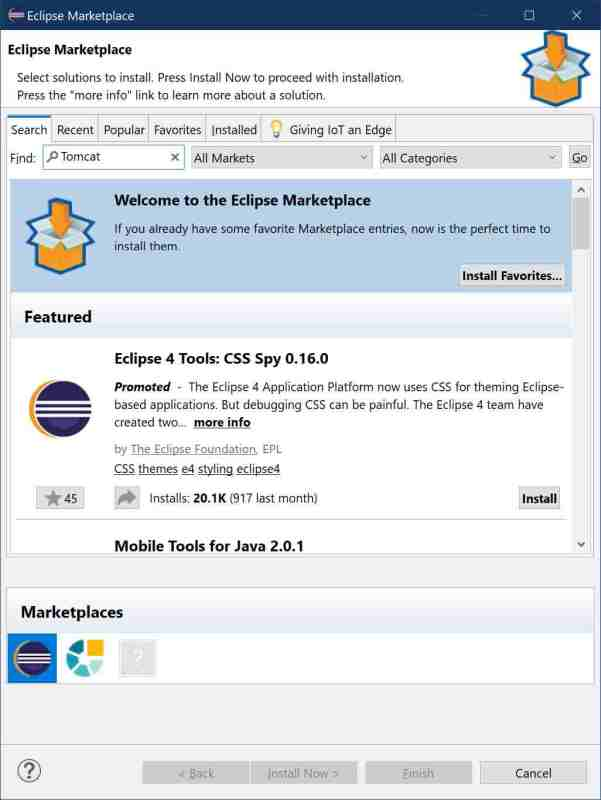
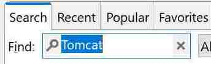

# Search marketplace

## Part II : installing the Tomcat Plugin

As the Marketplace contains lots of plugins, narrow the results by filtering the offering.

Go to the text field at the top of the dialog and enter 

> Tomcat

Then move the cursor to the looking glass icon on the left within the edit box and click on it.

