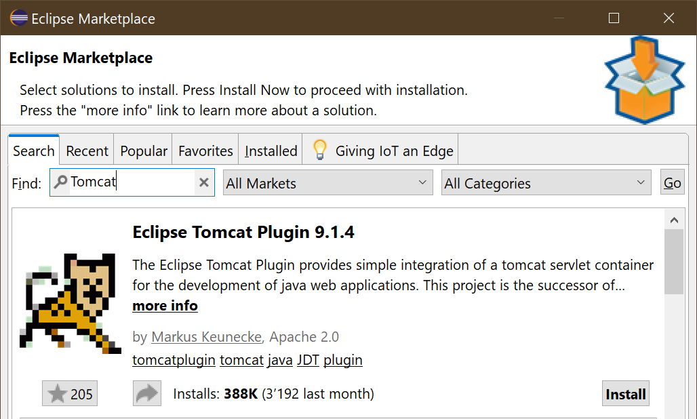

# Tomcat Plugin - Install from Marketplace

As the Marketplace contains lots of plugins, narrow the results by filtering the offering.

Go to the text field at the top of the dialog and enter 

Then press the RETURN/ENTER-key to search.

