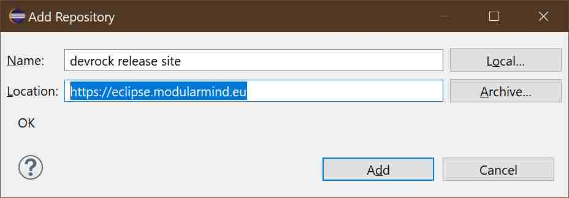

# Adding update-site

## Part III : devrock tool installation 

An update-site declaration in Eclipse consists of the name of the site and the URL of the site. 

While the name is free to choose, the URL is - obviously - fixed for an update-site.

> Note: once you added the declaration of the site, Eclipse will regularily check for updates on the site, and will prompt you to install updates if any are found.

