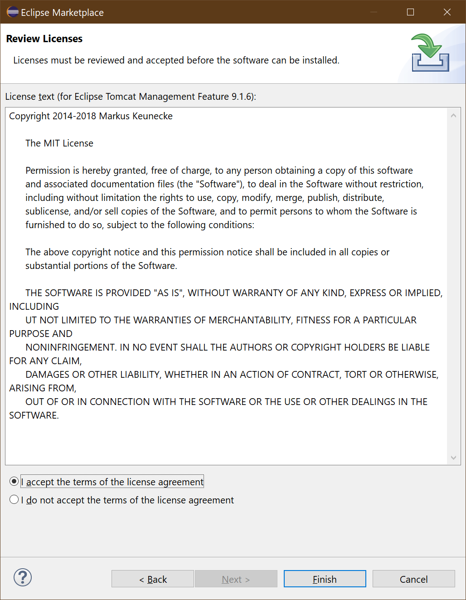

# Accept Tomcat License

The dialog will now prompt you to consent to the licenses that come with the content to be installed.

> Note: Installing from Eclipse Marketplace might trigger unrelated Eclipse updates, which might require accepting additional licenses.

Choose `I accept the terms of the license agreements`.

Press `Finish` to complete the installation.

