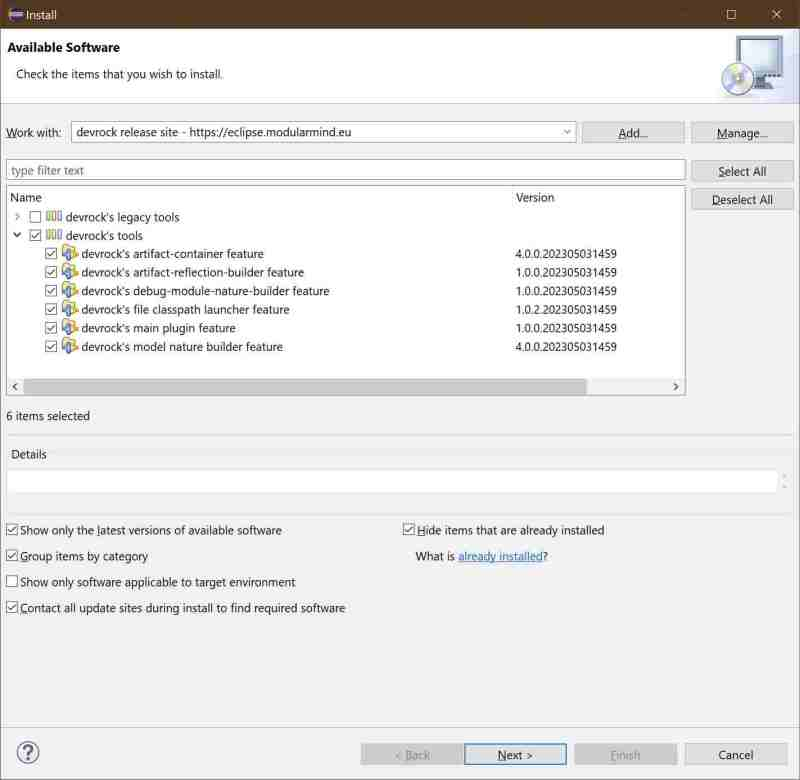

# Devrock update-site contents

## Part III : devrock tool installation 

 The dialog will now show the contents of the site, organized into categories.

 For interest here are the plugins listed in the category *devrock's tools*.

 Just select the category, and all its members are highlighted for installation.

Follows a short description of the plugins:

- devrock's artifact-container feature

    Implements a dynamic container for project classpaths 

- devrock's artifact-reflection-builder feature

    Implements a build-step to create additional data for artifacts

- devrock's debug-module-nature-builder feature
    
    Implements a build-step to adapt debug projects built with Jinni to the projects in Eclipse's current workspace.

- devrock's file classpath launcher feature

    Implements a feature that allows longer classpath statements for launching via Eclipse

- devrock's main plugin feature

    Implements common features for all other plugins.

- devrock's model-nature-builder feature

    Implements a build-step to create additional data required for models.

