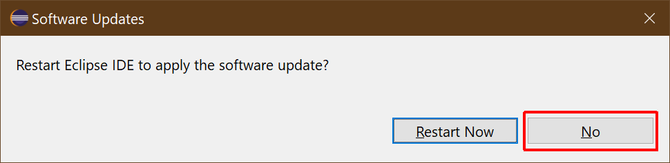

# Skipping Eclipse Restart after Tomcat Installation

After the installation has completed, the restart dialog below will pop-up. Skip that restart by clicking `No`

> Note: The installation may take a while as Eclipse is downloading several packages from the servers (as mentioned before).

