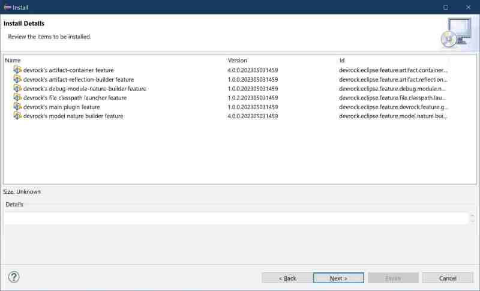

# Selected installation content

## Part III : devrock tool installation 

 The dialog will now show the details of the installation, i.e. what features are to be installed. 

Each feature has a name, a version and an id. The name and the id will not change for a plugin, but the versions obviously will. 

Press *Next* to continue with the installation.

