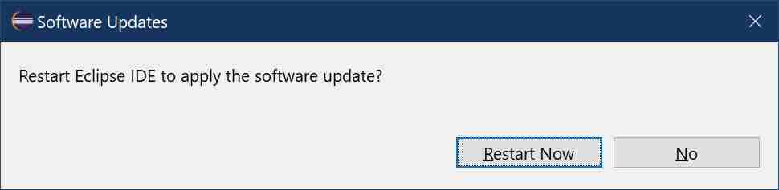

# Restart after Tomcat plugin installation

## Part II : installing the Tomcat Plugin

After the installation has successfully completed, Eclipse will prompt you to restart it. 

Let it restart or wait until the next step, the installation of the devrock tools for Eclipse, is done.