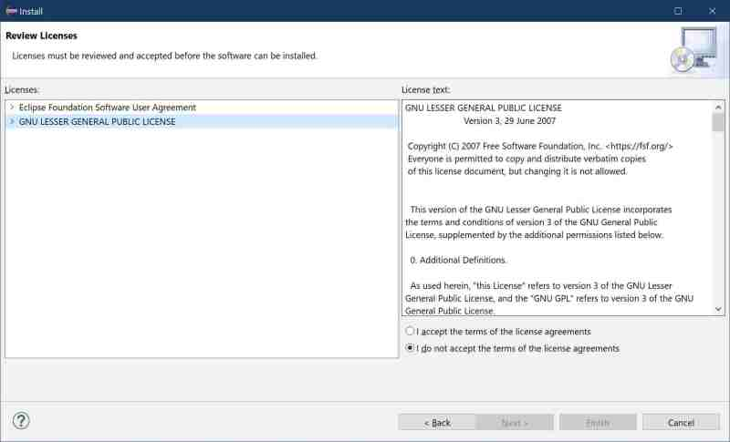

# Devrock license

## Part III : devrock tool installation 

 The dialog will now prompt you to consent to the licenses that come with the content to be installed. 

 Depending on how recent the Eclipse version was when you installed it, Eclipse might download some content that isn't related to the devrock features. So it might be very well possible that you will not only need the accept the license that the devrock features are released under (Gnu lesser general public license), but also the license related to the Eclipse updates (Eclipse Foundation Software Agreement).

Choose *I accept the terms of the license agreements* and select *Next >" to continue.

