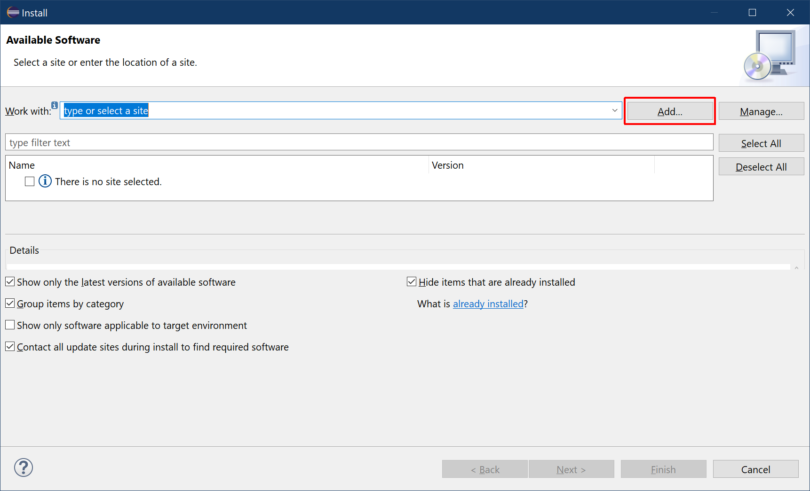

# Add Devrock Update Site

Eclipse has its own dialog to install new software or to update previously installed software. All external content is contained in such 'Eclipse update-sites'.

The update-site for the devrock tools needs to be added. Click on the button *Add..* on the upper right side of the dialog.

