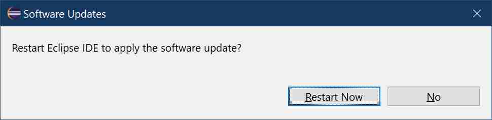

# Restart after devrock installation

## Part III : devrock tool installation 

 The installation is now running. It may take a while as Eclipse is downloading several packages from the servers (as mentioned before, not just from modularmind's update-site).

 After the installation has completed, the dialog below will pop-up.
 

Select *Restart now* to continue.

> The restart might take quite some time. As a quite bit has been installed, and depending on your operation system and installed security measures, your anti-virus tool will scan the content of the features. While this slows down the restart big time, it only happens when new content is installed into Eclipse.
