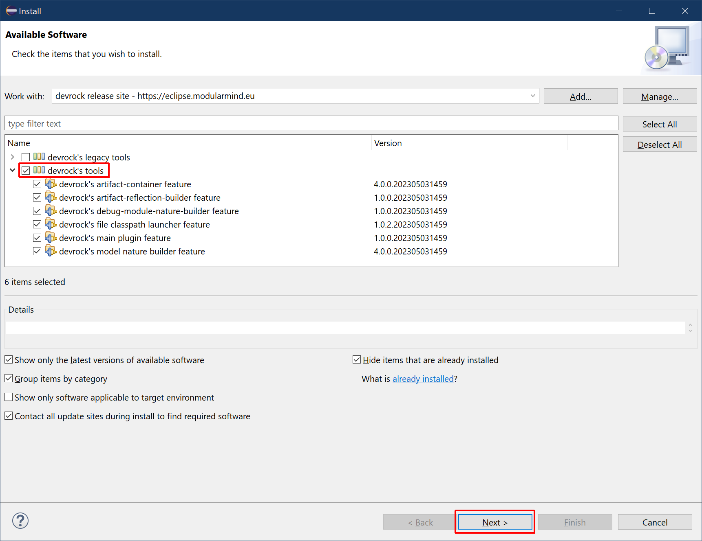

# Choose Devrock Plugins

The dialog shows the contents of the site, organized into categories.

For interest here are the plugins listed in the category `devrock's tools`. Just select this category, and all its members are highlighted for installation. 

Press `Next` to continue.

