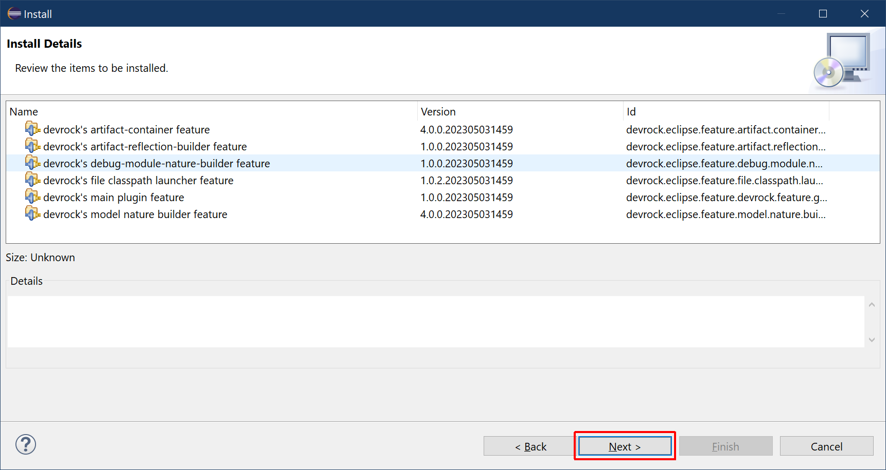

# Confirm Selected Devrock Installation

The dialog nows show the details of the installation, i.e. what features are to be installed. Each feature has a name, a version and an id. The name and the id will not change for a plugin, but the versions obviously will. 

Press `Next` to continue.

Press *Next* to continue with the installation.

