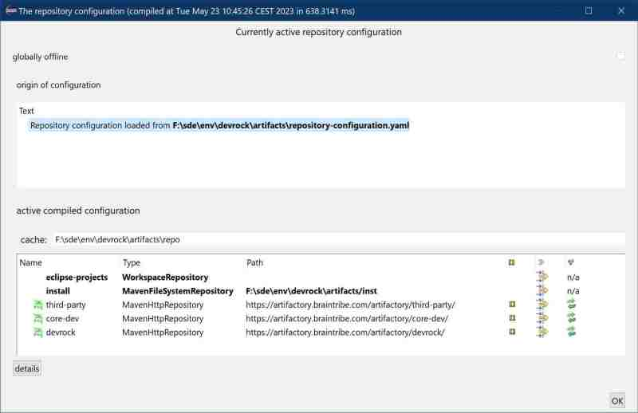

# Verifing Devrock installation II

## Part III : devrock tool installation 

After the restart, Eclipse will come-up again with the workspaces that was active when you started the installation.

If the workspace is part of a dev-env, you can check whether the installation went properly, *and* your dev-env is correctly setup.

If your workspace is empty, you need to access the functionality via Eclipse's preferences:

Open Eclipse's preferences dropdown menu, go to the *Devrock* section and select *Compile and show current repository-configuration*

The current configuration will be shown and should look like about like this: 

Common for all workspaces are the two top-entries in the repository table: 

- *eclipse-project*

    This is a repository that reflects the current content of the workspace

- *install* 

    This is the repository where your locally built artifacts are put, i.e. snapshots and *publishing candidates* go there.

