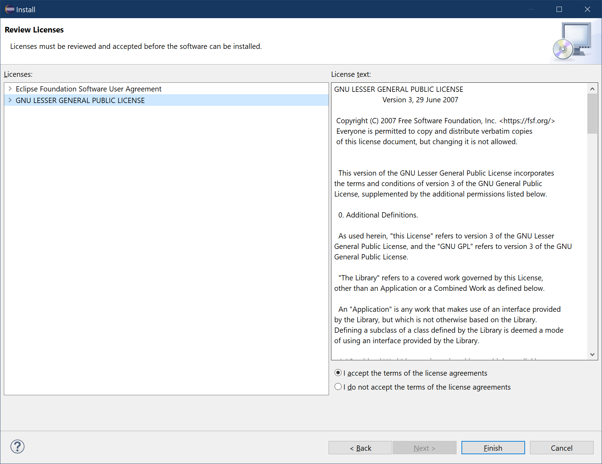

# Accept Devrock License

The dialog will now prompt you to consent to the licenses that come with the content to be installed.

Choose `I accept the terms of the license agreements`.

Press `Finish` to complete the installation.

