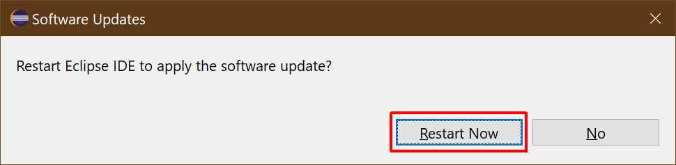

# Accept Restart after Devrock Plugin Installation

The installation is complete. It may take a while as Eclipse is downloading several packages from the servers (as mentioned before, not just from modularmind's update-site).

After the installation has completed, the restart dialog below will pop-up. Accept that restart by clicking `Restart Now`
 

