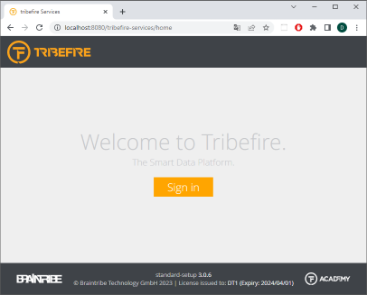

# Start Platform - Tutorial Introduction

In your command line move to the directory `devrock-sdk/env/explorer-experience/tf-setups/main/runtime/host/bin` and execute the command:

Unix
```cli
startup.sh
```
Windows
```cli
startup
```

The command will startup the tomcat with the platform on default port 8080. Wait until the log line appears (time may vary):

```plain
INFO    Catalina     'Server startup in [22165] milliseconds'  []
```

In order to verify the correct startup, open a browser and navigate to the following url:

```plain
http://localhost:8080
```

As you are currently not logged in, you are redirected to the platform login page that looks like:



Press the `Sign in` button and login with default credentials:

Username: __`cortex`__   
Password: __`cortex`__

_Note: The Chrome browser may warn about a password breach. You can savely ignore this warning, as we are using this password only for development purposes._

You are redirected to the platform landing page that looks like:


