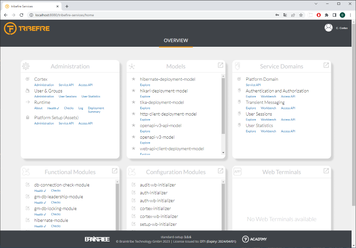
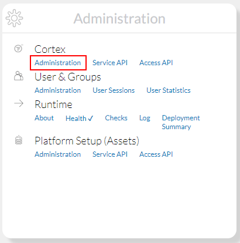

# Explorer Experience - Tutorial Introduction

The landing page can be accessed via `http://localhost:8080`. It gives you an overview on important system components which have been brought into the platform by the resolved setup we did earlier.



Navigate to the Administration explorer by following the link `Administration/Cortex/Administration`:



You are now in the `explorer` which is the generic UI client used in the platform. It allows you to read and modify data in various accesses. We are currently browsing one of those accesses called `cortex`, which contains the system's configuration.

As an example for the explorer functionality in regards of system configuration list all the platform's modules by clicking the item `System/Modules/All Modules` from the left menu. Modules are foundational system components that were brought into the platform by the setup we did earlier. They can bring functionality and extend configuration.

In order to stop the `platform` server, move to the folder `devrock-sdk/env/explorer-experience/tf-setups/main/runtime/host/bin` in the command line and execute the command:

Unix
```cli
shutdown.sh
```
Windows
```cli
shutdown
```